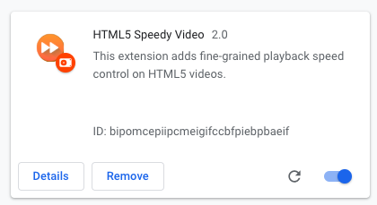
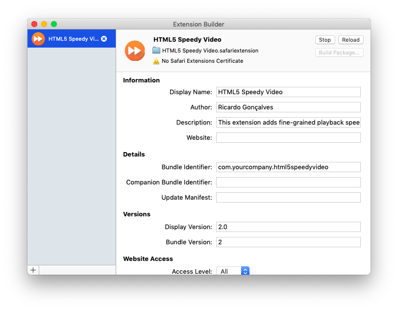

# HTML5 Speedy Video Extension (for Chrome and Safari)

A browser extension that is the easiest way to get more control over playback
speed of videos on Netflix, Youtube or websites that use VideoJS HTML5 player.
It also provides some easy shortcuts for video manipulation. Works on Chrome and
Safari (last tested on Chrome 40 and Safari 8), when the player is HTML5.

**Netflix**


**Youtube**


**VideoJS**


**NOTE**: Chrome is easier to install, but safari on a mac is *much* more CPU
efficient at video playback and in general. That's why I included a safari
version.

## Installing

Run this on the terminal:

```Shell
> git clone https://github.com/ricardobcl/HTML5-Speedy-Video-Extension.git
> cd HTML5-Speedy-Video-Extension
> make
```

Then:

#### For Chrome

Go to chrome extensions page (chrome://extensions/) and enable `Developer Mode`
on the top right corner. Then click `Load unpacked extension...` and select the
folder `HTML5 Speedy Video Chrome` of this project.



#### For Safari

**2016 Update:** I think Apple doesn't provide free Safari Developer Accounts anymore.
Therefore, you have to pay for a developer account or use Chrome.

1. **Get Safari Developer Certificate**

    Safari is a bit more complicated, because it requires a developer certificate to
    run any local extension. The good news is that it's free and should not take
    more than 10 min to do. Go [here](https://developer.apple.com/programs/safari/)
    to start the process.

2. **Open Extension Builder**

    Enable developer options in safari and then open the Extension Builder in
    the menu `Develop`
    ([here's](https://developer.apple.com/library/safari/documentatio n/Tools/Co
    nceptual/SafariExtensionGuide/UsingExtensionBuilder/UsingExtensionBuil
    der.html) a quick visual guide). Then you click on the `+` button and select
    `Add Extension...` and select the folder `HTML5 Speedy
    Video.safariextension` of this project. Then, just click `Install` in     the
    top right corner to install the extension, and finally, force a refresh (`cmd +
    shift + r` or `ctrl + shift + r`) or restart the browser the first time after
    loading the extension.



## Config

These are the variable that you can modify to fit your taste in `speedy.js`:

```Javascript
var default_speed = 1.0; // initial playback speed 
var default_delta = 0.2; // smallest increment or decrement of playback speed
var default_skip_small = 2; // number of seconds to (small) skip or rewind the video
var default_skip_big = 10; // number of seconds to (big) skip or rewind the video
var default_autoplay = false; // flag for autoplay the video
var debug = false; // flag to disable or enable console log debug info
var default_stop_video_timeout = 15000; // timeout in milliseconds before stop pausing the video
var max_tries_finding_video = 150; // max number of tries to finding the video
var youtube_playerbar_name_class = ".ytp-chrome-controls"; // name class of youtube player bar
var videojs_playerbar_name_class = ".vjs-control-bar"; // name class of VideoJS player bar
var netflix_playerbar_name_class = ".player-status"; // name class of Netflix player bar
var faster_text = "&#9758;";
var slower_text = "&#9756;";
```

Also, you can change which pages this extension runs by changing
`content_scripts` -> `matches` in `manifest.json` for *Chrome* (see [google's
content script docs](https://developer.chrome.com/extensions/content_scripts)
for more information), or `Whitelist` in `Info.plist` for *Safari* (see
[permission documentation for safari](https://developer.apple.com/library/safari
/documentation/Tools/Conceptual/SafariExtensionGuide/ExtensionPermissions/Extens
ionPermissions.html) for more information).

## Keyboard Shortcuts

It also adds these simple keyboard shortcuts:

Key             | Action
---             | ---
+               | Speed up by 0.2x
-               | Slow down by 0.2x
0 or 1          | Reset speed to 1x
2               | Set speed to 2x
3               | Set speed to 2.5x
4               | Set speed to 3x
f               | Full screen
Space           | Play / Pause
:arrow_left:    | \*\* Rewind 2 seconds
:arrow_right:   | \*\* Skip 2 seconds
:arrow_down:    | \*\* Rewind 10 seconds
:arrow_up:      | \*\* Skip 10 seconds


They are hard-coded, but it's really simple to modify if you want in
`speedy.js`.

\*\* Not on Netflix, although they do skip and rewind by default anyway, just
not these amounts.

## Forcing HTML5 Player:

At least on recent hardware, you should get the youtube HTML5 player by default.
If not, you can always disable flash to force YT to give the HTML5 player:

* On **chrome**: got to chrome://plugins/ and disable all flash player plugin;
* On **safari**: backup and remove `Flash Player.plugin` from `/Library/Internet Plug-Ins/`.


## License

[MIT license](http://opensource.org/licenses/MIT)
